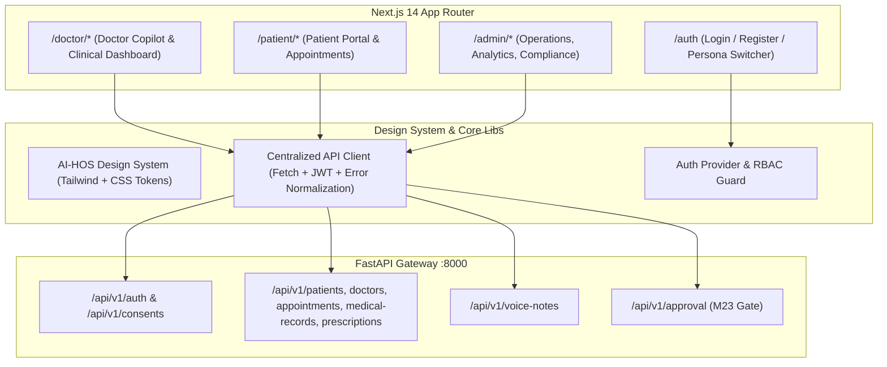

# Frontend Architecture & Design Specification — AI-HOS

**Document ID:** `AI-HOS-DOC-010`  
**Milestone:** `FE-01`  
**Version:** `1.0.0`  
**Status:** Approved Architecture Baseline  

---

## 1. Executive Summary & Architecture Overview

The **AI Healthcare Operating System (AI-HOS)** frontend is an enterprise-grade clinical and administrative web application designed to connect patients, healthcare providers, and clinical administrators. The platform integrates ambient intelligence (voice scribing, clinical note drafting, and prescription safety checks) into clinical workflows while maintaining strict human-in-the-loop oversight.

### Absolute Source-of-Truth Hierarchy
1. **Source of Truth #1 — AI-HOS Backend (`/backend`):** Determines all available functionality, API endpoints, schemas, authentication/JWT flow, RBAC permissions, and lifecycle states (`DRAFT` vs `FINALIZED`).
2. **Source of Truth #2 — AI-HOS Master Requirements (`/docs`):** Defines the five-layer architecture, clinical safety rules, non-functional targets (P95 latency, WCAG 2.1 AA), and human approval boundaries.
3. **Source of Truth #3 — Reference Visuals (`ezgif-4b27425cfb27027d-jpg.zip`):** Dictates the design direction, modern dark/light aesthetic, typography hierarchy, spacing system, card layouts, and micro-interactions.



---

## 2. Route Structure & Role Separation

AI-HOS enforces physical and architectural separation between roles. There is no single generic dashboard that adapts purely via role flags; instead, each vertical maintains distinct workflows, density levels, and security requirements.

### Route Mapping Matrix

| Route | Role Permitted | Purpose & Content | Status in FE-01 |
| :--- | :--- | :--- | :--- |
| `/` | Public | Landing page with role portals and system status | Skeleton existing |
| `/auth/login` | Public | Split-screen authentication with email/password and persona switcher | To implement (FE-03) |
| `/auth/register` | Public | Patient registration & onboarding | To implement (FE-03) |
| `/auth/unauthorized` | Public | 403 Forbidden explanation with return route | To implement (FE-03) |
| `/doctor` | `doctor` | Main Doctor Dashboard, queue, and active patient selector | Skeleton existing (refactor FE-05) |
| `/doctor/appointments` | `doctor` | Doctor appointment schedule, time slots, and status filters | To implement (FE-06) |
| `/doctor/patients/[id]` | `doctor` | Detailed patient history, past visits, and active medications | Component exists (refactor FE-05) |
| `/doctor/consultation` | `doctor` | Active consultation workspace: voice note recorder (M18), ambient scribe (M21) | To implement (FE-07/08) |
| `/doctor/prescriptions` | `doctor` | Prescription drafting with interaction warnings (M22) | To implement (FE-09) |
| `/doctor/review` | `doctor`, `admin` | Mandatory M23 Human-in-the-Loop Review and Approval Gate | To implement (FE-10) |
| `/patient` | `patient` | Patient portal: upcoming visits, medical records, prescriptions | Skeleton existing (refactor FE-11) |
| `/patient/intake` | `patient` | AI Receptionist symptom collection and triage (M12-14) | To implement (FE-12) |
| `/patient/appointments` | `patient` | Appointment booking and doctor slot selection | To implement (FE-12) |
| `/admin` | `admin` | Operations console: user management, consent, audit logs | Skeleton existing (refactor FE-13) |

---

## 3. Component Architecture & Design System

### Design System Foundation (Inspired by Reference ZIP)
The visual reference (`ezgif-4b27425cfb27027d-jpg.zip`) establishes a high-density, modern SaaS aesthetic:
- **Base Palette:** Deep dark slate canvas (`#0B0F19` / `#0D1117`) paired with crisp slate cards (`#111827` / `#1E293B`), subtle indigo ambient gradients, and crisp borders (`rgba(255, 255, 255, 0.08)`).
- **Accents:** Electric clinical blue (`#2563EB` / `#3B82F6`) for primary interactive elements, cyan (`#06B6D4`) for AI metadata, emerald (`#10B981`) for approved/finalized states, amber (`#F59E0B`) for review warnings, and rose (`#EF4444`) for critical red-flag alerts.
- **Typography:** Inter sans-serif with strict semantic scale (display, h1–h4, body-sm, caption, code-mono).
- **Surface Elevation:** Translucent glass panels (`backdrop-blur-md bg-slate-900/60 border border-slate-800`), rounded corners (`rounded-xl` / `rounded-2xl`), and subtle inner glows.

### Component Directory Hierarchy (`/frontend/src/components`)

```
src/components/
├── ui/                        # Reusable UI primitives
│   ├── Button.tsx             # Primary, secondary, danger, ghost, loading states
│   ├── Input.tsx              # Text, email, search inputs with leading/trailing icons
│   ├── Select.tsx             # Custom select dropdown
│   ├── Card.tsx               # Header, body, footer, glass styling
│   ├── Badge.tsx              # Category, status, confidence pill badges
│   ├── Modal.tsx              # Accessible backdrop and dialog box
│   ├── Table.tsx              # Data table with header, row, and cell components
│   ├── Tabs.tsx               # Navigational and content tabs
│   ├── Alert.tsx              # Info, warning, emergency alert banners
│   ├── Spinner.tsx            # Fluid loading spinners and skeleton loaders
│   └── Tooltip.tsx            # Accessible contextual popups
├── layout/                    # Application chrome
│   ├── DoctorShell.tsx        # Doctor sidebar, persistent header, breadcrumb
│   ├── PatientShell.tsx       # Patient top navigation and mobile drawer
│   ├── AdminShell.tsx         # Admin sidebar and operational quick stats
│   └── Header.tsx             # Role badge, user avatar, theme toggle, logout
├── clinical/                  # Healthcare & Copilot domain components
│   ├── PatientSummary.tsx     # Demographics, vitals, active conditions, ABHA ID
│   ├── AudioRecorder.tsx      # MediaRecorder WebM capture with wave animation & timer
│   ├── ScribeDraftView.tsx    # Chief complaint, HPI, exam, assessment, plan
│   ├── PrescriptionDraft.tsx  # Medication items, dosages, allergy & interaction warnings
│   ├── AIConfidenceBadge.tsx  # Confidence %, source basis explanation popup
│   ├── StatusBadge.tsx        # DRAFT (yellow), FINALIZED (emerald), CANCELLED (rose)
│   └── ApprovalActionPanel.tsx# Explicit Approve / Reject / Edit review buttons
└── feedback/                  # State indicators
    ├── EmptyState.tsx         # Friendly empty state illustrations
    └── ErrorBoundary.tsx      # Graceful error catching and recovery
```

---

## 4. Visual Reference Mapping

Analysis of the 25 frames from `ezgif-4b27425cfb27027d-jpg.zip` and the architecture diagram from `AI Healthcare Operating System (AI-HOS).zip`:

| Reference UI Pattern | Visual Characteristics | AI-HOS Target Screen | Backend API Dependency |
| :--- | :--- | :--- | :--- |
| **Split Auth Screen (Frames 1-25)** | Left dark indigo hero container with value pills & testimonial; right structured form with email/password, eye-toggle, "Remember me", and quick-login pills. | `/auth/login` | `POST /api/v1/auth/login` |
| **Theme Selector Dropdown (Frames 2-4, 20-25)** | Floating pill dropdown with Sun/Moon icons, Light/Dark/System options, and active checkmarks. | Global Top Navigation (`Header.tsx`) | Client-side theme provider (`next-themes` / CSS classes) |
| **Quick Persona Switcher (Frames 1, 25)** | Pill buttons allowing 1-click test login for different organizational roles. | `/auth/login` (Dev Mode) | Autofills pre-seeded accounts: `doctor@ai-hos.org`, `patient@ai-hos.org`, `admin@ai-hos.org` |
| **Metric & Status Cards** | Sleek dark card with icon box, large numeric stat, trend indicator, and micro-label. | `/doctor` & `/admin` dashboards | `GET /api/v1/appointments/`, `GET /api/v1/approval/drafts` |
| **Patient Selector List** | Compact sidebar list with avatar initial, patient name, DOB, gender, and active selection border. | `/doctor` Dashboard sidebar | `GET /api/v1/patients/?page_size=100` |
| **Clinical Consultation Workspace** | Multi-panel layout: Patient context top-left, voice recorder top-right, dual-column Scribe note & Prescription draft bottom. | `/doctor/consultation` | `POST /api/v1/voice-notes/upload/`, Scribe & Prescription agents |
| **Approval Banner & Actions** | Floating or pinned review toolbar with warning badges, basis toggle, and Approve / Reject CTA buttons. | `/doctor/review` | `POST /api/v1/approval/medical-records/{id}/review`, `POST /api/v1/approval/prescriptions/{id}/review` |

---

## 5. API Integration Strategy & Security

### Centralized API Client Architecture
All network communication flows through `/frontend/src/lib/api.ts`. Raw `fetch()` or `axios` calls within UI components are strictly forbidden.

1. **Authentication Interceptor:** Injects `Authorization: Bearer <token>` from `localStorage` or session memory.
2. **Token Refresh Loop:** Automatically catches `401 Unauthorized`, calls `POST /api/v1/auth/refresh`, updates the stored token, and retries the original request once.
3. **Normalized Error Envelope:** Backend returns `{ error: { code, message, details } }`. The API client translates these into typed `ApiError` instances with human-friendly clinical messages.
4. **Security Hardening:** No sensitive API keys (Gemini, Groq, NVIDIA) are exposed to client code. All AI operations are orchestrated server-side.

### Backend Endpoints Inventory

```
Authentication & Users:
  POST   /api/v1/auth/signup               -> Register new account
  POST   /api/v1/auth/login                -> Obtain access & refresh tokens
  POST   /api/v1/auth/refresh              -> Refresh expired access token
  GET    /api/v1/auth/me                   -> Retrieve active profile

Core Clinical Resources:
  GET    /api/v1/doctors/                  -> List doctors (filter: specialty)
  GET    /api/v1/doctors/{id}/             -> Get doctor profile
  GET    /api/v1/patients/                 -> List patients (search: name, ABHA)
  GET    /api/v1/patients/{id}/            -> Get patient profile
  GET    /api/v1/appointments/             -> List appointments (filters: doctor, patient, date, status)
  POST   /api/v1/appointments/             -> Create appointment (with conflict check)
  DELETE /api/v1/appointments/{id}/        -> Soft cancel appointment
  GET    /api/v1/medical-records/{id}/     -> Get medical record
  GET    /api/v1/medical-records/patient/{id}/ -> List records for patient
  POST   /api/v1/medical-records/          -> Create record (defaults to DRAFT)
  GET    /api/v1/prescriptions/{id}/       -> Get prescription
  GET    /api/v1/prescriptions/patient/{id}/   -> List prescriptions for patient
  GET    /api/v1/prescriptions/appointment/{id}/ -> List prescriptions for appointment
  POST   /api/v1/prescriptions/check-interactions/ -> Drug-drug and allergy check

Doctor Copilot & Voice:
  POST   /api/v1/voice-notes/upload/       -> Upload consultation audio (multipart)
  GET    /api/v1/voice-notes/{id}/         -> Get voice note record
  GET    /api/v1/voice-notes/appointment/{id}/ -> List notes for visit

Mandatory M23 Review & Approval Gate:
  GET    /api/v1/approval/drafts           -> List all draft notes & prescriptions
  POST   /api/v1/approval/medical-records/{id}/review -> Approve / Reject / Request changes
  POST   /api/v1/approval/prescriptions/{id}/review   -> Approve / Reject / Request changes
```

---

## 6. Clinical Safety & Human-in-the-Loop Governance

In compliance with AI-HOS Charter rules and medical AI safety protocols:
1. **Never Finalized Automatically:** All outputs generated by ambient scribing or prescription drafting are tagged `DRAFT`.
2. **Mandatory Explainability:** Every AI section must render a visible `AIConfidenceBadge` displaying the confidence score and the underlying transcription context (`basis`).
3. **Allergy & Interaction Highlighting:** Identified drug interactions or patient allergies are rendered in high-visibility amber/red callout boxes that require explicit doctor acknowledgment.
4. **Permanent Audit Trail:** The doctor who approves or amends the draft is stamped into the record (`reviewed_by`, `reviewed_at`) upon status change to `FINALIZED`.

---

## 7. Frontend Milestones Roadmap

| Milestone | Code | Focus |
| :--- | :--- | :--- |
| **Audit & Architecture** | `FE-01` | Repository audit, reference mapping, architecture doc, baseline verification |
| **Design System Foundation** | `FE-02` | Dark/light tokens, typography, buttons, inputs, cards, tables, modal primitives |
| **Authentication & RBAC** | `FE-03` | Split login screen, persona switcher, JWT session manager, role route guards |
| **Doctor App Shell** | `FE-04` | Responsive doctor navigation, sidebar, user profile area, breadcrumb headers |
| **Doctor Dashboard & Summary** | `FE-05` | Active appointments, patient selector, full medical summary view |
| **Appointments & Records UI** | `FE-06` | Calendar/queue list, appointment details, historical clinical record views |
| **Consultation & Voice Notes** | `FE-07` | Microphone capture, recording waveform, WebM upload to `/voice-notes/upload/` |
| **Doctor Copilot Scribe** | `FE-08` | AI draft clinical note viewer (SOAP), confidence indicator, section editor |
| **Prescription Drafting** | `FE-09` | Medication cards, dosage picker, interaction & allergy warnings checker |
| **Doctor Review Gate (M23)** | `FE-10` | Full review screen, edit draft, explicit Approve / Reject workflow |
| **Patient Application** | `FE-11` | Patient portal, profile, visit history, prescription access |
| **Intake, Triage & Booking** | `FE-12` | Patient voice/text intake flow, triage routing, appointment booking |
| **Admin Console & Audit** | `FE-13` | System stats, provider oversight, consent viewer, compliance views |
| **Full QA & Production Audit**| `FE-14` | Cross-browser QA, accessibility audit (WCAG AA), responsive verification |

---

## 8. Known Backend Limitations & Gaps

1. **Audit Logs Read API:** While the `AuditLogger` and `AuditLoggingMiddleware` write events to the `audit_logs` table, there is currently no `GET /api/v1/audit-logs` endpoint. Admin view will display operational statistics and consent data until a dedicated log viewer endpoint is exposed.
2. **Direct Agent Trigger Endpoints:** The Scribe Agent (`ai-services/agents/scribe_agent.py`) is registered in Python's internal orchestrator. In standard flow, voice note upload stores audio; background or explicit agent execution triggers transcription. The frontend will support both direct consultation drafting and uploaded note inspection.
3. **Medical Record List Authorization:** Note that `GET /api/v1/medical-records/` is restricted to admins only. Doctors must query records via `GET /api/v1/medical-records/patient/{patient_id}/`, which requires an existing appointment association with the patient.
